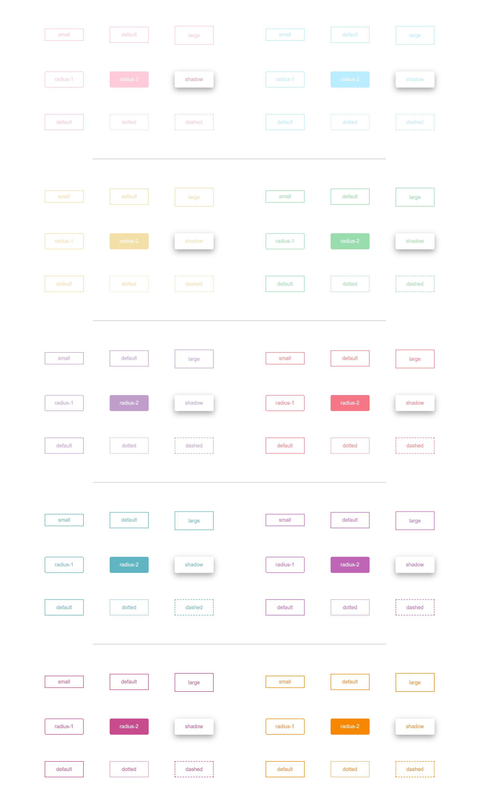

# tg-button-ui

> Made with create-react-library

[](https://www.npmjs.com/package/tg-button-ui) [](https://standardjs.com)

## BUTTONS


## Install

```bash
npm install --save tg-button-ui
```

## Usage

`TYPE = [small , large , radius-1 , radius-2 , shadow , dotted , dashed]`
<br>
`COLOR = [baby-blue , melon , mint-green , lilac , pome-flo , turquoise , purple , fuchsia , orange]`
<br>

```jsx
import React, { Component } from 'react'

import { Button as MyComponent } from 'tg-button-ui'
import 'tg-button-ui/dist/index.css'

class Example extends Component {
  render() {
    return (
     <MyComponent type='small' text='small'/>
     <MyComponent text='default'/>
     <MyComponent type='large' text='large'/>
     <MyComponent text="radius-1" type="radius-white"/>
     <MyComponent text="radius-2" type="radius-colorful"/>
     <MyComponent text="shadow" type="shadow"/>
     <MyComponent text="dotted" type="dotted"/>
     <MyComponent text="dashed" type="dashed"/>
     <MyComponent text='default' color="baby-blue"/>
     <MyComponent text="radius-1" type="radius-white" color="orange"/>
    )
  }
}
```
## License

MIT © [tugceguzle](https://github.com/tugceguzle)
